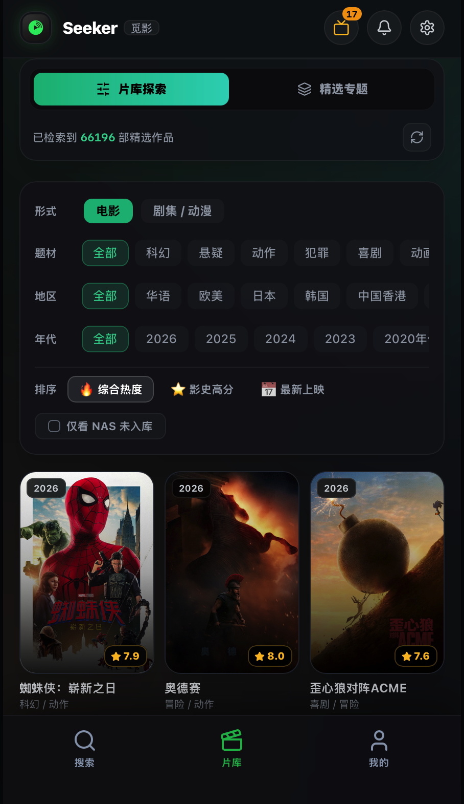
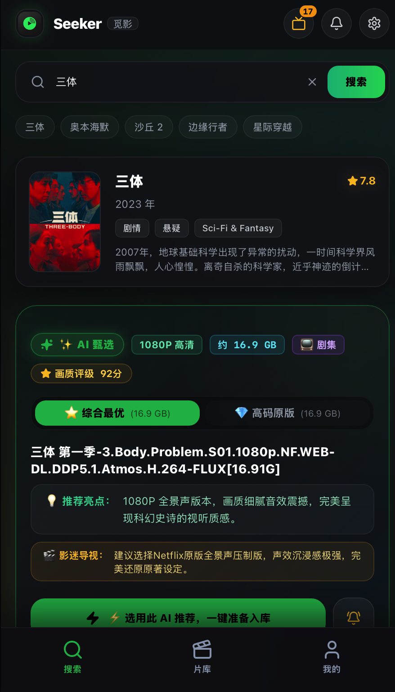
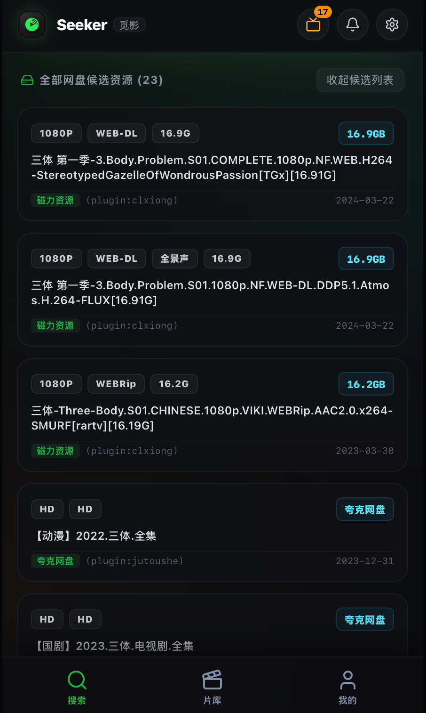
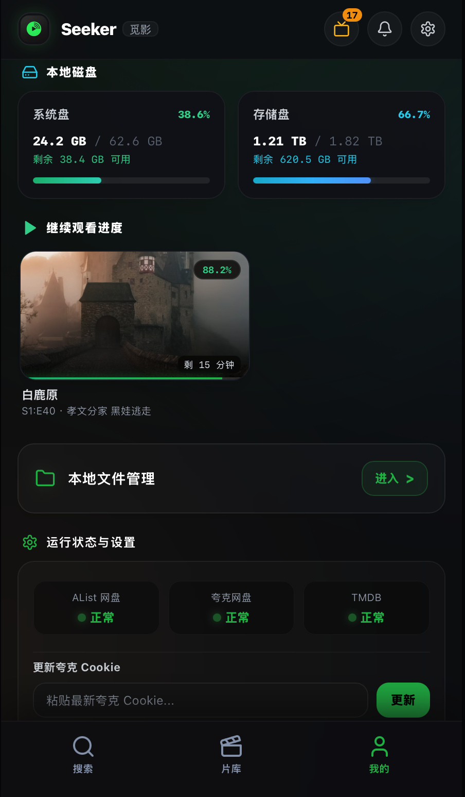
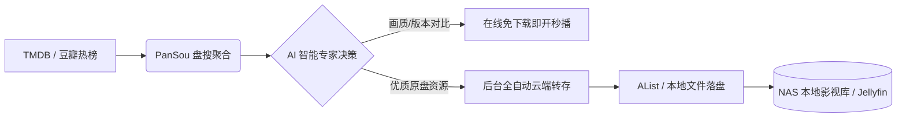

<div align="center">


# 🎬 Seeker (觅影)

**现代化全网影视聚合搜索 · 在线流媒体播放 · AI 智能选片分析 · 离线自动落盘中枢**

[](https://opensource.org/licenses/MIT)
[](https://fastapi.tiangolo.com)
[](https://react.dev)
[](https://www.docker.com)
[](https://tailwindcss.com)

</div>

---

## 📖 项目简介

**Seeker (觅影)** 是一套专为家庭影音玩家、Homelab 爱好者及网盘追剧用户打造的**现代化全网影视聚合搜索、AI 智能选片决策、在线流播与无感落盘中枢**。

它通过打通 **「资源库浏览 ➔ 盘搜全网聚合 ➔ AI 版本筛选 ➔ 在线流播嗅探 ➔ 自动化转存 ➔ 本地物理落盘」** 的完整闭环，让您彻底摆脱繁琐的手动操作，享受媲美商业级流媒体的家庭影音体验。


<div align="center">
  <br />
  <h3>✨ 极简暗黑流媒体美学 · 全端沉浸式交互</h3>
  <table border="0">
    <tr>
      <td width="25%" align="center" valign="top">
        
        <br />
        <sub><b>🎬 热门片库与精细筛选</b></sub>
      </td>
      <td width="25%" align="center" valign="top">
        
        <br />
        <sub><b>🧠 Gemini AI 决策与版本导视</b></sub>
      </td>
      <td width="25%" align="center" valign="top">
        
        <br />
        <sub><b>🔍 全网盘源并发极速匹配</b></sub>
      </td>
      <td width="25%" align="center" valign="top">
        
        <br />
        <sub><b>📊 物理磁盘与服务运行中枢</b></sub>
      </td>
    </tr>
  </table>
  <br />
</div>


---

## 💡 为什么开发 Seeker？（与传统方案对比）

在家庭影音自动化领域，以 **MoviePilot / Nastool** 为代表的老牌工具虽然功能强大，但其生态高度依赖 **PT（Private Tracker）站**：
- ❌ **PT 门槛过高**：求药难、新手考核严酷、必须常年 24 小时开机做种保种；
- ❌ **网络与硬件损耗**：家庭宽带上行被长时间跑满，机械硬盘频繁寻道造成寿命损耗与噪音发热；
- ❌ **传统网盘追剧割裂**：用户往往需要在手机/电脑上找资源 ➔ 复制网盘链接 ➔ 打开网盘客户端转存 ➔ 手动下载到本地 ➔ 拷贝到 NAS 影视目录，链路极其碎片化。

### 🚀 Seeker 的破局方案：现代云盘高速闭环
1. **彻底告别 PT 负担**：无需 PT 站账号、无需做种、无需担忧分享率，拥抱超大容量且下载飞快的网盘生态；
2. **全自动中转落盘**：完美对接 **PanSou（盘搜）** 等聚合搜索容器，搜到资源后由系统在后台一键完成「网盘秒级转存 ➔ 提取码自动匹配 ➔ 本地 NAS 极速归档」，整个流程完全免去人工干预；
3. **即点即播与按需落盘并存**：临时追剧可直接在线串流嗅探秒播，想永久收藏的影视一键加入后台队列物理落盘。

---

## 🔄 全链路工作流图解 (Workflow)



---

## 🎯 目标用户群体

- 🏠 **家庭 NAS / 轻量服务器玩家**：飞牛 fnOS、群晖、威联通、Unraid、Linux 小主机用户；
- 🎬 **怕折腾的影音爱好者**：不想花大量精力挂 PT、保种，只想下班回家舒服看个高清大片；
- ☁️ **云盘重度用户**：拥有夸克网盘、阿里云盘或 115 空间，希望充分盘活云盘资源与本地大硬盘的联动；
- 📱 **多端全场景体验者**：既需要在电脑大屏端沉浸式选片，又需要在手机端随时通过底部抽屉快速点播与追剧。

---

## 🌟 核心亮点与技术特性

- 🔍 **全网聚合搜索 (PanSou 对接)**：无缝桥接 PanSou 搜索容器，海量影视、综艺、动漫一网打尽，秒级并发响应与热度权重排序。
- 🧠 **AI 智能选片决策 (Google Gemini)**：不仅是找资源，更有 AI 充当专业选片师。智能识别 4K 原盘、杜比视界、未删减导剪版，并生成精准观影导视与剧集差异对比。
- 📺 **秒播级在线流媒体解析**：深度解析网盘目录与多码率视频流，无需等待漫长的整片下载，点开即刻享受高清在线观影。
- 📥 **自动化离线转存与静默落盘**：内置异步任务队列与状态流，自动完成云端转存、目录嗅探与物理落盘，实时可视化追踪下载进度。
- 🎨 **流媒体级现代 UI/UX**：采用 **React 19 + Tailwind CSS** 精雕细琢，深度适配手机触控抽屉与 PC 宽屏卡片，丝滑轻快。
- 🛡️ **严格安全沙箱架构**：内置文件隔离沙箱，严禁跨目录越权；高危磁盘销毁操作设置大写口令 `DELETE` 校验，无后门无风险。
- 🐳 **零依赖单容器开箱即用**：前后端整合极简编译，支持 Docker Compose 一键启动。

---

## 📦 最佳实践与准备建议 (Best Practices)

为获得极致丝滑的使用体验，建议在部署 Seeker 之前/同时准备以下基础设施：

1. **部署 PanSou（盘搜）容器（强烈推荐）**：
   Seeker 后端原生支持对接本地或局域网的 PanSou 实例，配置 `PANSOU_URL`、`PANSOU_USER` 与 `PANSOU_PASS` 后即可解锁全自动全网影视爬虫与聚合搜索能力。
2. **准备主流网盘会员（如夸克网盘 SVIP 等）**：
   网盘 VIP 能带来千兆级的无限制不限速下载、大容量转存空间以及免解压能力，让「云端转存 ➔ 本地落盘」达到百兆/秒以上的极致体验。
3. **搭配 AList 或 Jellyfin / Emby**：
   Seeker 支持将落盘后的影视库自动规范命名并归档到指定目录，供本地 Jellyfin、Emby 或 Plex 自动刮削与大屏海报墙呈现。

---

## 🚀 极速部署 (Quick Start)

### 方式 1：使用 Docker Compose（推荐）

1. 创建 `docker-compose.yml` 文件：

```yaml
version: '3.8'

services:
  seeker:
    image: ghcr.io/dave2758/seeker:latest # 直接拉取官方云端构建镜像 (或本地构建: build: .)
    container_name: seeker
    restart: unless-stopped
    ports:
      - "8899:8899"
    environment:
      - PORT=8899
      - MEDIA_DIR=/data/movies
      # 可选：配置 TMDB API Key (已有默认内置 Key)
      # - TMDB_API_KEY=your_tmdb_key
      # 可选：配置 Gemini AI 选片分析
      # - GEMINI_API_KEY=your_gemini_key
      # 可选：对接 PanSou 盘搜容器
      # - PANSOU_URL=http://your-nas-ip:9933
      # - PANSOU_USER=your_pansou_username
      # - PANSOU_PASS=your_pansou_password
      # 可选：对接 AList 自动转存
      # - ALIST_URL=http://your-nas-ip:5244
      # - ALIST_USER=your_alist_username
      # - ALIST_PASS=your_alist_password
    volumes:
      # 映射您的本地/NAS 电影存放目录
      - /path/to/your/movies:/data/movies
```

2. 启动服务：
```bash
docker compose up -d
```

3. 打开浏览器访问：`http://你的服务器IP:8899` 即可畅享体验！

---

### 方式 2：使用 Docker 命令一行运行

```bash
docker run -d \
  --name seeker \
  --restart unless-stopped \
  -p 8899:8899 \
  -v /path/to/your/movies:/data/movies \
  ghcr.io/dave2758/seeker:latest
```

---

## 🛠️ 本地手动开发与构建

### 1. 环境要求
- **Node.js**: >= 18.0.0
- **Python**: >= 3.10

### 2. 构建前端
```bash
cd frontend
npm install
npm run build
```

### 3. 运行后端
```bash
cd ../backend
python3 -m venv venv
source venv/bin/activate
pip install -r requirements.txt

# 启动开发服务器
python3 -m uvicorn main:app --host 0.0.0.0 --port 8899 --reload
```

---

## ⚙️ 环境变量配置说明 (Configuration)

可在 `.env` 或 Docker Compose 的 `environment` 中配置以下参数：

| 环境变量名 | 默认值 | 说明 |
| :--- | :--- | :--- |
| `PORT` | `8899` | 网页与 API 服务监听端口 |
| `MEDIA_DIR` | `/data/movies` | 媒体库核心根路径，影视下载落盘的目标目录 |
| `LOCAL_MEDIA_PATHS` | `/data/movies` | 本地媒体库扫描路径，多路径用英文逗号分隔 |
| `TMDB_API_KEY` | *(内置通用Key)* | TMDB 电影海报与元数据 API Key |
| `GEMINI_API_KEY` | *(留空)* | 可选，启用 Gemini AI 选片分析与剧集对比 |
| `GEMINI_MODEL` | `gemini-1.5-flash` | Gemini 使用的大模型版本 |
| `GEMINI_PROXY` | *(留空)* | 可选，国内直连 Google API 的 HTTP 代理地址 |
| `ALIST_URL` | `http://127.0.0.1:5244` | 可选，AList 服务的访问地址 |
| `ALIST_USER` | *(留空)* | 可选，AList 管理员账号 |
| `ALIST_PASS` | *(留空)* | 可选，AList 管理员密码 |
| `JELLYFIN_URL` | `http://127.0.0.1:40097` | 可选，Jellyfin 服务地址 |
| `QUARK_COOKIE` | *(留空)* | 可选，默认网盘 Cookie（支持在网页前端随时配置） |

---

## ⚠️ 免责声明 (Disclaimer)

1. 本项目仅用于个人学习、编程技术交流以及学术研究，严禁用于任何商业牟利或非法用途。
2. 本项目作为开源播放与聚合检索工具，**不存储、不上传、亦不分发任何音视频源文件或受版权保护的内容**。所有搜索结果与网络数据均来源于公共网络接口或第三方用户自定义输入。
3. 使用本项目所产生的一切版权争议或法律后果，均由使用者自行承担，与本项目原作者及贡献者无关。
4. 请自觉尊重知识产权，支持正版影视影视作品。

---

## 📄 开源许可证 (License)

本项目基于 [MIT License](LICENSE) 协议开源。
